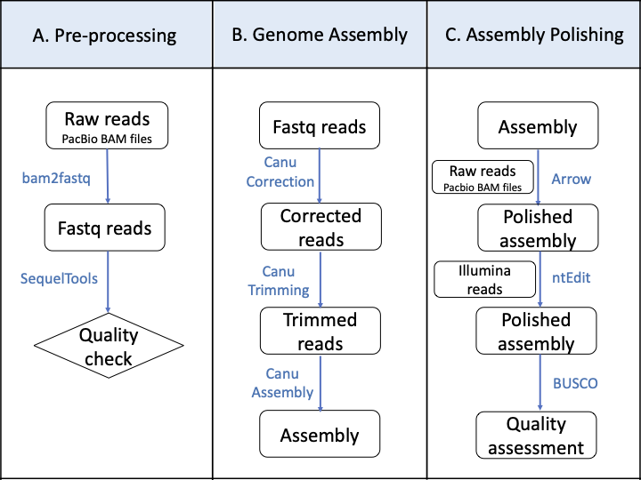

[](http://www.gnu.org/licenses/gpl-3.0)

# Maize Genome Assembly with PacBio Reads

Assembly of high-quality genomes is critical for the characterization of structural variations (SV), for the development of a high-resolution map of polymorphisms and to serve as the foundation for gene annotation. In recent years，the advent of high-quality, long-read sequencing has enabled an affordable generation of highly contiguous de novo assemblies, as evidenced by the release of many reference genomes, including from species with large and complex genomes. The long-read sequencing technology is instrumental in accurately profiling the highly abundant repetitive sequences which otherwise challenge sequence alignment and assembly programs in eukaryotic genomes. In this protocol, we describe a step-by-step pipeline to assemble a maize genome with PacBio long reads using Canu and polish the genome using Arrow and ntEdit. Our protocol provides an optional procedure for genome assembly and could be adapted for other plant species.

Here we briefly introduce the specific purposes of the dir system. 

 
1. __graphs__: The graphs/figures produced during the analysis.
2. __input__: Here, we store a subset of the raw input data. 
3. __README__: This document.

## Overview of the workflow: Pre-processing of the PacBio raw reads, genome assembly and polishing

This is the workflow to show a step-by-step pipeline to assemble a maize genome with PacBio long reads.



## Installation

- __Running environment__: 
    - The workflow was constructed based on the __Red Hat Enterprise Linux Server release 7.7 (Maipo)__.

- __Required software and versions__: 
    - [SMRT Tools v10.1.0](https://www.pacb.com/support/software-downloads/)
    - [SequelTools v1.1.0](https://github.com/ISUgenomics/SequelTools)
    - [Canu v1.8](https://canu.readthedocs.io/en/latest/)
    - [BUSCO v3.0.2](https://busco.ezlab.org/)
    - [Pbalign v0.3.2](https://github.com/PacificBiosciences/pbalign)
    - [Sambamba v0.6.9](https://github.com/biod/sambamba)
    - [Samtools v1.12](https://github.com/samtools/samtools)
    - [Arrow v2.3.3](https://github.com/PacificBiosciences/GenomicConsensus/)
    - [ntHits v1.2.1](https://github.com/bcgsc/ntHits)
    - [ntEdit v1.2.1](https://github.com/bcgsc/ntEdit)

## Input Data

The raw data of each SMRT-cell include files named *.subreads.bam, *.subreads.pbi and *.subreadset.xml. One subreads.bam file contains multiple copies of subreads generated from the single SMRTBell from high-quality regions. It is analysis-ready and will be used directly for the following analysis. Subreads containing unaligned base calls outside of high-quality regions or excised adapter and barcode sequences are retained in a scraps.bam file. 

The example data used here is a subset of one subreads.bam file generated by using PacBio Sequel System.  

- subreads.bam file: `input/raw_PacBio.subreads.bam`   

## Major steps

#### Step 1: A.	Pre-processing of the PacBio raw reads
- Covert the *.subreads.bam files to fastq files with the PacBio tool bam2fastq.
- Use -c 9 to get all the subreads and then let the assembler decide which reads are good for genome assembly. The command bam2fastq will generate a fastq file (raw_PacBio.fastq) 

```
bam2fastq -c 9 raw_PacBio.subreads.bam
```

- Use SequelTools to perform quality control of PacBio Sequel raw sequencing data from multiple SMRTcells.
- First, generate a file with a list of locations of *.subreads.bam files and *.scraps.bam files.

```
 find $PWD/*.subreads.bam > subFiles.txt
 find $PWD/*.scraps.bam > scrFiles.txt
```

- Then, run the QC tool of SequelTools with *.scraps.bam files.
- Use -t Q to use the QC tool specifically. The argument -u is mandatory to identify a file listing the locations of the subread BAM files. The argument -c is optional to identify a file listing the locations of the scraps BAM files.

```
  ./SequelTools.sh -t Q -u subFiles.txt -c scrFiles.txt
```

#### Step 2: Genome assembly using Canu

Here, we provide instructions for Canu version 1.8 to perform the maize genome assembly. Canu assembles PacBio or Oxford Nanopore sequences in three phases: correction, trimming and assembly. The recommended coverage for eukaryotic genomes is between 30x and 60x. Here, we will use traditional PacBio long reads to show how to perform the genome assembly using Canu. Canu can automatically perform correction, trimming and assembly in series by default. However, the users can also run these three phases separately if they want to test different parameters of each phase or if they only want to run trimming and assembly phases using corrected reads generated from other software as following. In this protocol, we will show how to run each phase of Canu separately. If the users want to run those three phases automatically by default, please refer to the software’s manual for further information.

1. Correct the raw reads
- In this phase, Canu will do multiple rounds of overlapping and correction. In order to run the correction phase specifically, the users need to use -pacbio-raw option to provide raw PacBio reads as input data and use -correct option to let Canu only correct the raw reads. If the users have more than 4,096 input files, they must consolidate them into fewer files. The output of the correction phase will be one compressed fasta file with all corrected reads (maize.correctedReads.fasta.gz in our example).
- The -p <string> option is mandatory to set the file name prefix of intermediate and output files. The -d <assembly directory> is optional. If it is not provided, Canu will run in the current directory. The genomeSize parameter is required by Canu which will be used to determine coverage in the input reads. The users can provide the estimated genome size in bases or with common SI prefixes.

```
canu -correct \
     -p maize -d maize \
     genomeSize=2.3g \
     -pacbio-raw raw_PacBio.fastq
```

2. Trim the corrected reads
- The trim phase will decide the high-quality regions using overlapping reads and remove the remaining SMRTbell adapter sequences. The input data should be the output of the correction phase. The users need to use -pacbio-corrected option to provide corrected PacBio reads as input data and use -trim option to let Canu only trim the corrected reads. The output of the trimming phase will be one compressed fasta file with all corrected and trimmed reads (maize.trimmedReads.fasta.gz in our example).

```
canu -trim \
     -p maize -d maize \
     genomeSize=2.3g \
     -pacbio-corrected maize/maize.correctedReads.fasta.gz

```
    
3. Assemble the corrected and trimmed reads into unitigs
- The assembly phase will identify the consistent overlaps, order and orient reads into contigs and generate a consensus sequence for the unitig. The output of the trimming phase will be used for unitig construction. The users need to -pacbio-corrected option to provide corrected and trimmed PacBio reads as input data and use -assemble option to let Canu only assemble the corrected and trimmed reads. 
- Canu will generate three assembled sequences including maize.contigs.fasta, maize.unitigs.fasta and maize.unassembled.fasta, where maize.contigs.fasta is the primary output.

```
canu -assemble \
     -p maize -d maize \
     genomeSize=2.3g \
     -pacbio-corrected maize/maize.trimmedReads.fasta.gz

```

#### Step 3: Assembly polishing
1. Use Arrow to pollish the assembly
- To improve the accuracy of the genome assembly, Arrow will be used to polish the contigs assembled from the Sequel System data by mapping a set of raw PacBio raw reads to the contigs and building a consensus of this read mapping. The variantCaller provided by GenomicConsensus package is the command line tool to call Arrow algorithm to get consensus and variant calling on the mapped reads.    

    - First, align the raw PacBio reads (*.subreads.bam files) to the assembled genome sequence using pbalign with the following command:
    
    ```
    pbalign raw_PacBio.subreads.bam maize.contigs.fasta raw_PacBio.subreads_aligned.bam
    ```
    
    - Before polishing the assembled genome sequence, the reference genome should be indexed with samtools faidx.
    
    ```
    samtools faidx maize.contigs.fasta
    ```
    
    - Run variantCaller command line tool to call Arrow on the aligned bam files.
    - The --algorithm option sets the algorithm as Arrow, --referenceFilename provides the file name of the assembled genome FASTA file, -j is optional to set the number of threads and -o sets the output files. The users can generate multiple outputs with different formats, including FASTA, FASTQ, GFF and VCF.
    
    ```
    variantCaller --algorithm=arrow raw_PacBio.subreads_aligned.bam \
	              --referenceFilename maize.contigs.fasta \
	              -j 32 \
	              -o Maize.contigs.polished.arrow.fastq \
	              -o Maize.contigs.polished.arrow.fasta \
	              -o Maize.contigs.polished.arrow.gff

    ```

2. Use ntEdit to further polish the assembly
- It is highly recommended to use high-quality Illumina short-read data to further polish the assembled genome sequence. Here, we use the pipeline called ntEdit to polish the assembled genome sequence. It is a bloom filter k-mer based approach that significantly reduces the running time.
	
	- First, run the tool ntHits to split the Illumina short reads into kmers. The kmers pass the coverage thresholds will be used to build a bloom filter (BF). 
	- The -c option sets the maximum coverage threshold for reporting kmer. We recommend setting -c as 1 for low coverage Illumina short-read data (<20x), 2 for coverage (20-30x) or running with the --solid with high coverage data (>30x) to report non-error kmers. The option --outbloom will output the coverage-thresholded kmers in a Bloom filter and option -p will set the prefix for the output file name (The name of output of ntHits is maize_k25.bf based on the above settings). The bloom filter bit size is defined by the option -b (-b 36: keep the Bloom filter false positive rate low (~0.0005)) and the kmer size can be adjusted using the option -k. Optionally, the number of CPUs can be set (-t <int>). The input file can be two pair-end fastq files or a file listing the path to all pair-end fastq files.
	
	
	```
	nthits -c 2 --outbloom -p maize -b 36 -k 25 -t 8 \
       	       maize.R1.pair.fq maize.R2.pair.fq

	```
	
	- Then, ntEdit will polish the Arrow-polished contigs from the assembled genome sequence based on BF data.
	- The -f option is the users’ assembled genome input, -r sets the bloom filter file generated from ntHits, -k sets the length of the kmer, and -b sets the output file prefix (The name of output of ntHits is Maize.contigs.polished.arrow.ntedit_edited.fa based on the above settings). Optionally, the number of CPUs can be set (-t <int>).
	

	```
	ntedit -f Maize.contigs.polished.arrow.fasta \
               -r maize_k25.bf -k 25 -b Maize.contigs.polished.arrow.ntedit -t 24

	```
	
3. Quality assessment
- After genome assembly and genome polishing, it is necessary to check the completeness and duplication of the assembly. BUSCO is a commonly used tool to assess the completeness of the genome assembly. Check the newest version at https://busco.ezlab.org/. The users can run BUSCO by using the following command line:
- The -i option is the assembled fasta sequence, -o is the output file name, -m sets the mode for BUSCO (geno or genome for genome assemblies, tran or transcriptome for transcriptome assemblies or prot or proteins, for annotated gene sets) and -l is the dataset used as reference for comparison (The lineage data (embryophyta_odb9) is related to maize). The lineage data can be downloaded from BUSCO website.	
	
```
run_BUSCO.py -i Maize.contigs.polished.arrow.ntedit_edited.fa -o PacBio_assembly.BUSCO -m geno -sp maize -l embryophyta_odb9 	
```

## License
It is a free and open source software, licensed under []() (choose a license from the suggested list:  [GPLv3](https://github.com/github/choosealicense.com/blob/gh-pages/_licenses/gpl-3.0.txt), [MIT](https://github.com/github/choosealicense.com/blob/gh-pages/LICENSE.md), or [CC BY 4.0](https://github.com/github/choosealicense.com/blob/gh-pages/_licenses/cc-by-4.0.txt)).
